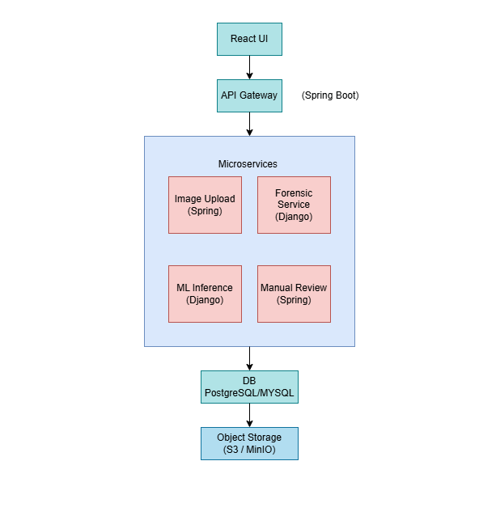
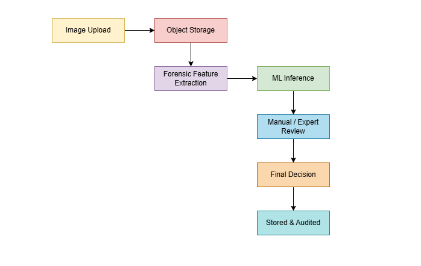

# 📘 AI Image Authenticity Detection System (AI-IADS)

An end-to-end, microservice-based system that detects whether an image is real (camera-captured) or AI-generated, using forensic analysis, machine learning, deep learning, and human verification.

Designed with scalability, explainability, and DevOps best practices.

---

## 📌 Table of Contents

1. Introduction  
2. Project Objectives  
3. Overall System Description  
4. High-Level Architecture  
5. Low-Level Architecture (Service-wise)  
6. Database Design  
7. Data Collection Process  
8. Machine Learning & Deep Learning Flow  
9. Non-Functional Requirements  
10. DevOps & Collaboration  
11. Complete Project Flow (End-to-End)  
12. Conclusion  

---

## 1. INTRODUCTION

### 1.1 Purpose

The purpose of this project is to design and implement a scalable, explainable, microservice-based system that detects whether an image is real or AI-generated.

The system combines:
- Image forensic analysis
- Machine learning and deep learning
- Human-in-the-loop validation
- Production-grade DevOps practices

---

### 1.2 Scope

The system:
- Accepts images from users
- Performs forensic analysis using multiple test cases
- Uses ML/DL models trained on curated datasets
- Allows manual and forensic expert verification
- Produces a final explainable verdict
- Is built using microservice architecture
- Is deployable using DevOps best practices

---

## 2. OBJECTIVES OF THE PROJECT

### 2.1 Technical Objectives

- Learn and implement Microservice Architecture
- Work with Java, Python, and React
- Design ML/DL lifecycle (data → training → deployment)
- Implement human-in-the-loop AI
- Apply DevOps practices (Docker, CI/CD, Kubernetes)
- Build scalable and maintainable systems

---

### 2.2 Learning Objectives

- Understand distributed system design
- Learn service-to-service communication
- Practice API design and versioning
- Implement explainable AI
- Gain experience in collaborative development
- Apply software engineering best practices

---

### 2.3 Industry Relevance

This project simulates real-world systems used in:
- Digital forensics
- Media authenticity verification
- Content moderation platforms
- AI governance and compliance tools

---

## 3. OVERALL SYSTEM DESCRIPTION

### 3.1 User Roles

Role: End User — Uploads images  
Role: Reviewer — Performs manual labeling  
Role: Forensic Expert — Final verification  
Role: Admin — Manages system and ML models  

---

### 3.2 Operating Environment

- Web application (browser-based)
- Backend services (Dockerized)
- Database server (PostgreSQL / MySQL)
- Object storage (S3 / MinIO)
- Kubernetes cluster (optional)

---

## 4. HIGH-LEVEL ARCHITECTURE

### 4.1 High-Level Architecture Diagram (Logical)

---

## 5. LOW-LEVEL ARCHITECTURE (SERVICE-WISE)

### 5.1 Image Upload Service (Spring Boot)

Responsibilities:
- Accept image uploads
- Validate file format
- Store image in object storage
- Generate unique image ID

Endpoints:
- POST /images/upload
- GET  /images/{id}

---

### 5.2 Forensic Feature Extraction Service (Django)

Responsibilities:
- Metadata analysis
- FFT analysis
- Noise analysis
- Color distribution analysis
- Compression artifact detection
- Symmetry and structural checks

Sample Output:
{
  image_id: img123  
  fft_variance: 0.83  
  noise_std: 1.2  
  color_bias: true  
}

---

### 5.3 ML Inference Service (Django)

Responsibilities:
- Load trained ML/DL models
- Perform inference
- Return prediction with confidence score
- Support model versioning

Important:
- No training happens here
- Read-only inference service

---

### 5.4 Manual Review Service (Spring Boot)

Responsibilities:
- Blind human labeling
- Forensic expert validation
- Conflict resolution
- Final verdict approval

---

### 5.5 API Gateway (Spring Boot)

Responsibilities:
- JWT-based authentication
- Request routing
- Rate limiting
- Centralized logging

---

## 6. DATABASE DESIGN

### 6.1 Database Choice

PostgreSQL (Recommended)

Reasons:
- Better JSON support
- Strong consistency
- Widely used in microservice architectures

---

### 6.2 Core Tables

- images
- features
- ml_predictions
- human_labels
- final_decisions
- audit_logs
- model_versions

---

## 7. DATA COLLECTION PROCESS

### 7.1 Data Sources

Kaggle — AI vs Real datasets  
Research Institutes — GAN detection datasets  
Public Benchmarks — FaceForensics++, CelebDF  
Raw Camera Data — Mobile / DSLR images  
Generated Data — Stable Diffusion, DALL·E  

---

### 7.2 Dataset Handling Strategy

- Store raw images in object storage
- Store metadata and labels in database
- Maintain dataset versioning
- Freeze dataset snapshots before training

---

## 8. MACHINE LEARNING & DEEP LEARNING FLOW

### 8.1 Training (Offline)

- Random Forest
- XGBoost
- ResNet (future)
- EfficientNet (future)

---

### 8.2 Inference (Online)

- Django-based microservice
- Loads approved model version
- Produces predictions with confidence score

---

## 9. NON-FUNCTIONAL REQUIREMENTS

Performance:
- Inference latency < 500 ms
- Async processing for heavy tasks

Scalability:
- Horizontal scaling via Kubernetes
- Stateless services

Security:
- JWT authentication
- Secure file uploads
- Audit logging

Maintainability:
- Clean service boundaries
- Versioned APIs
- CI/CD pipelines

---

## 10. DEVOPS & COLLABORATION

DevOps Practices:
- Docker for all services
- GitHub Actions CI/CD
- Kubernetes deployment
- Environment-based configuration

Collaboration:
- Git branching strategy
- Code reviews
- Shared API contracts
- Centralized documentation

---

## 11. COMPLETE PROJECT FLOW (END-TO-END)

---

## 12. CONCLUSION

This project demonstrates:
- Microservice architecture mastery
- End-to-end AI system lifecycle
- Cross-technology integration
- Explainable and responsible AI
- Production-ready DevOps mindset

If you find this project useful, consider starring the repository.
